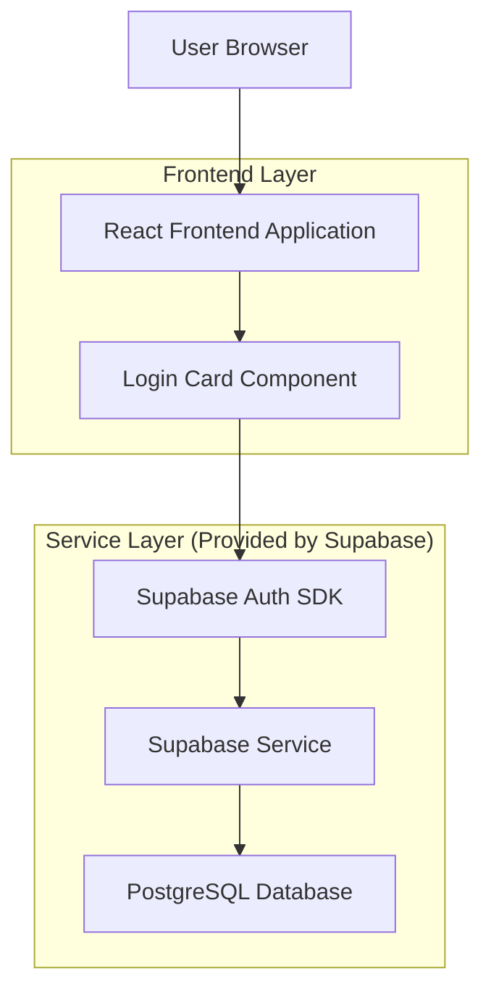
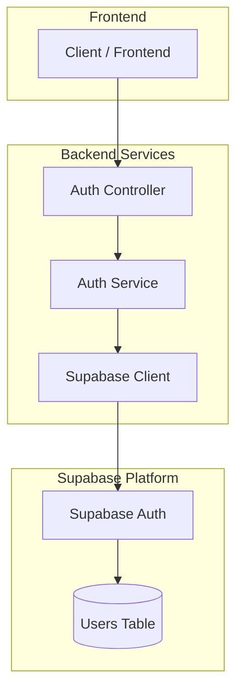
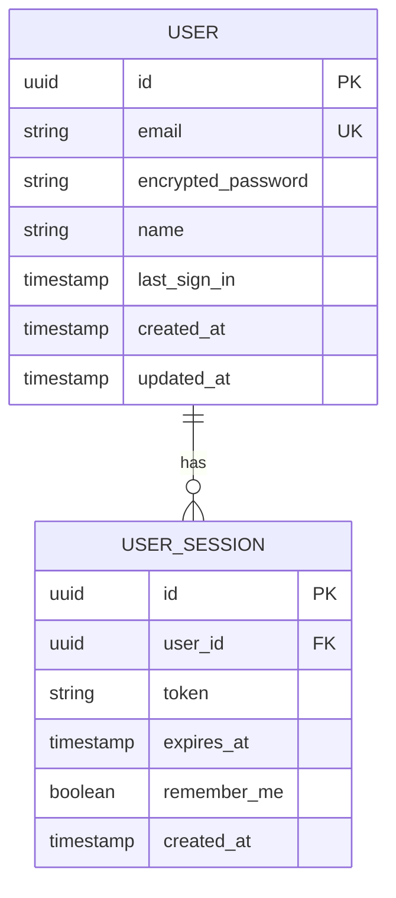

## 1. Architecture design



## 2. Technology Description
- Frontend: React@18 + tailwindcss@3 + vite
- Initialization Tool: vite-init
- Backend: Supabase (Auth + Database)
- Authentication: Supabase Auth with JWT tokens
- State Management: React Context API
- Icons: React Icons
- Form Validation: React Hook Form + Yup

## 3. Route definitions
| Route | Purpose |
|-------|---------|
| / | Landing page with login button |
| /login | Login card page |
| /dashboard | Main dashboard after successful login |
| /auth/callback | Supabase auth callback handler |

## 4. API definitions

### 4.1 Authentication API

User login
```
POST /api/v1/auth/login
```

Request:
| Param Name| Param Type  | isRequired  | Description |
|-----------|-------------|-------------|-------------|
| email     | string      | true        | User email address |
| password  | string      | true        | User password |
| remember  | boolean     | false       | Remember login session |

Response:
| Param Name| Param Type  | Description |
|-----------|-------------|-------------|
| token     | string      | JWT authentication token |
| user      | object      | User data object |
| expires   | number      | Token expiration timestamp |

Example Request:
```json
{
  "email": "user@example.com",
  "password": "securepassword123",
  "remember": true
}
```

Example Response:
```json
{
  "token": "eyJhbGciOiJIUzI1NiIsInR5cCI6IkpXVCJ9...",
  "user": {
    "id": "123e4567-e89b-12d3-a456-426614174000",
    "email": "user@example.com",
    "name": "John Doe"
  },
  "expires": 1640995200
}
```

### 4.2 Token Validation
```
GET /api/v1/auth/validate
```

Headers:
| Header Name| Header Value  | Description |
|------------|---------------|-------------|
| Authorization | Bearer {token} | JWT token for validation |

## 5. Server architecture diagram



## 6. Data model

### 6.1 Data model definition



### 6.2 Data Definition Language

User Table (users)
```sql
-- create table
CREATE TABLE users (
    id UUID PRIMARY KEY DEFAULT gen_random_uuid(),
    email VARCHAR(255) UNIQUE NOT NULL,
    encrypted_password VARCHAR(255) NOT NULL,
    name VARCHAR(100),
    last_sign_in TIMESTAMP WITH TIME ZONE,
    created_at TIMESTAMP WITH TIME ZONE DEFAULT NOW(),
    updated_at TIMESTAMP WITH TIME ZONE DEFAULT NOW()
);

-- create index
CREATE INDEX idx_users_email ON users(email);
CREATE INDEX idx_users_created_at ON users(created_at DESC);

-- grant permissions
GRANT SELECT ON users TO anon;
GRANT ALL PRIVILEGES ON users TO authenticated;
```

User Sessions Table (user_sessions)
```sql
-- create table
CREATE TABLE user_sessions (
    id UUID PRIMARY KEY DEFAULT gen_random_uuid(),
    user_id UUID REFERENCES users(id) ON DELETE CASCADE,
    token VARCHAR(500) NOT NULL,
    expires_at TIMESTAMP WITH TIME ZONE NOT NULL,
    remember_me BOOLEAN DEFAULT false,
    created_at TIMESTAMP WITH TIME ZONE DEFAULT NOW()
);

-- create index
CREATE INDEX idx_user_sessions_user_id ON user_sessions(user_id);
CREATE INDEX idx_user_sessions_token ON user_sessions(token);
CREATE INDEX idx_user_sessions_expires ON user_sessions(expires_at);

-- grant permissions
GRANT SELECT ON user_sessions TO anon;
GRANT ALL PRIVILEGES ON user_sessions TO authenticated;
```

### 6.3 Supabase Row Level Security (RLS) Policies

```sql
-- Enable RLS
ALTER TABLE users ENABLE ROW LEVEL SECURITY;
ALTER TABLE user_sessions ENABLE ROW LEVEL SECURITY;

-- Users policies
CREATE POLICY "Users can view own profile" ON users
    FOR SELECT USING (auth.uid() = id);

CREATE POLICY "Users can update own profile" ON users
    FOR UPDATE USING (auth.uid() = id);

-- Sessions policies
CREATE POLICY "Users can view own sessions" ON user_sessions
    FOR SELECT USING (auth.uid() = user_id);

CREATE POLICY "Users can delete own sessions" ON user_sessions
    FOR DELETE USING (auth.uid() = user_id);
```

### 6.4 Frontend Component Structure

Login Card Component Props:
```typescript
interface LoginCardProps {
  onSuccess: (token: string, user: User) => void;
  onError: (error: string) => void;
  redirectPath?: string;
}

interface User {
  id: string;
  email: string;
  name: string;
}

interface LoginForm {
  email: string;
  password: string;
  remember: boolean;
}
```

### 6.5 Local Storage Schema

```typescript
interface StoredAuth {
  token: string;
  user: User;
  expires: number;
  remember: boolean;
}

// Key: 'auth_token'
// Structure: Base64 encoded JSON
```