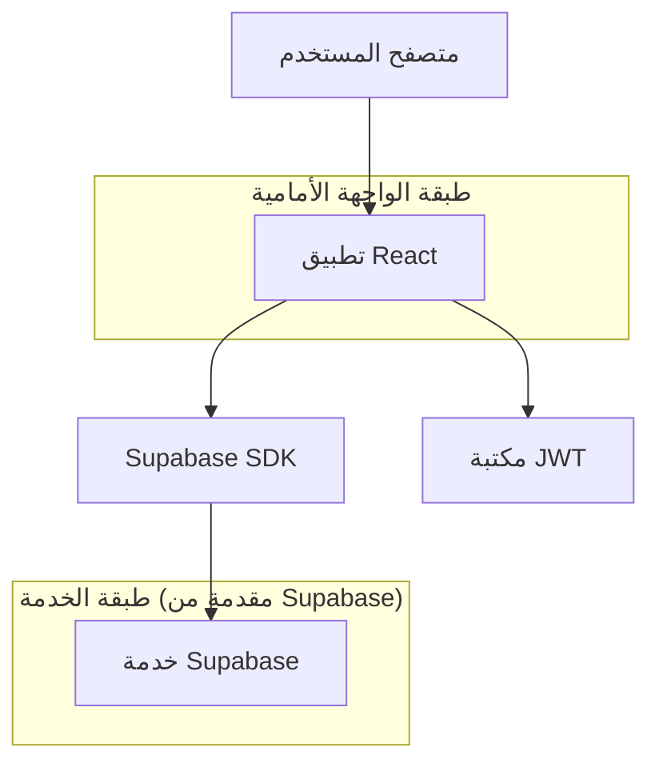
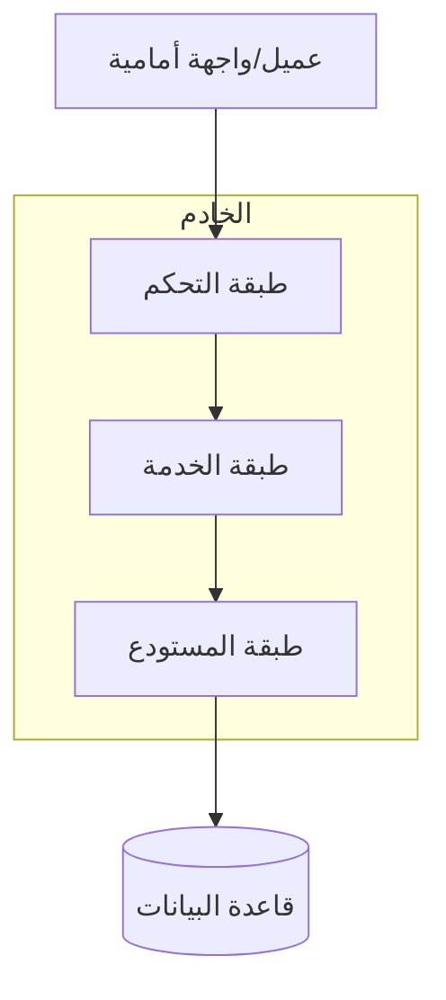
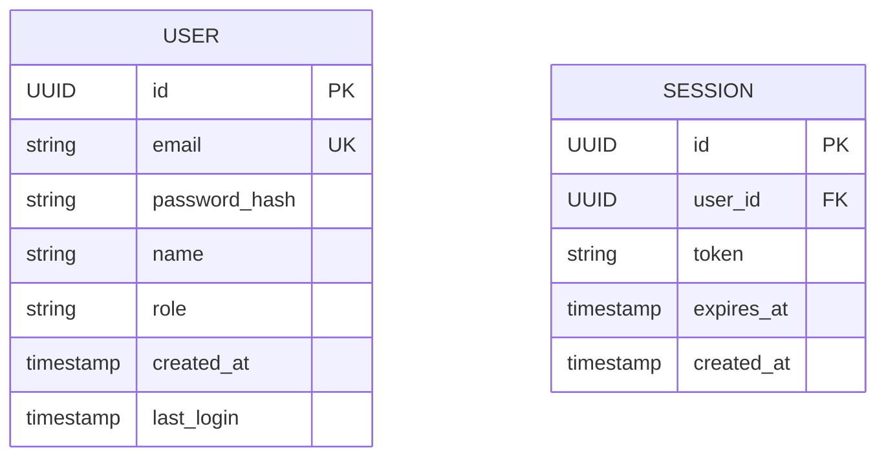

## 1. تصميم البنية



## 2. وصف التكنولوجيا
- الواجهة الأمامية: React@18 + tailwindcss@3 + vite
- أداة التهيئة: vite-init
- المصادقة: Supabase Auth مع JWT
- قاعدة البيانات: Supabase (PostgreSQL)
- إدارة الحالة: React Context API

## 3. تعريفات المسارات
| المسار | الغرض |
|-------|---------|
| / | صفحة الهبوط، تعرض نموذج تسجيل الدخول |
| /dashboard | لوحة التحكم الرئيسية بعد تسجيل الدخول |
| /dashboard/joe | الصفحة المخصصة للمستخدم جو |
| /login | صفحة تسجيل الدخول المنفصلة (اختياري) |
| /register | صفحة إنشاء حساب جديد |

## 4. تعريفات واجهة برمجة التطبيقات

### 4.1 واجهة برمجة التطبيقات الأساسية

مصادقة المستخدم
```
POST /api/auth/login
```

الطلب:
| اسم المعامل| نوع المعامل | مطلوب | الوصف |
|-----------|-------------|-------------|-------------|
| email | string | نعم | بريد المستخدم الإلكتروني |
| password | string | نعم | كلمة المرور (نص عادي أو مشفرة) |

الاستجابة:
| اسم المعامل| نوع المعامل | الوصف |
|-----------|-------------|-------------|
| token | string | توكن JWT للمصادقة |
| user | object | بيانات المستخدم الأساسية |
| redirect | string | مسار إعادة التوجيه (/dashboard/joe) |

مثال
```json
{
  "email": "joe@example.com",
  "password": "123456"
}
```

الاستجابة الناجحة:
```json
{
  "token": "eyJhbGciOiJIUzI1NiIsInR5cCI6IkpXVCJ9...",
  "user": {
    "id": "123",
    "email": "joe@example.com",
    "name": "Joe"
  },
  "redirect": "/dashboard/joe"
}
```

## 5. مخطط بنية الخادم



## 6. نموذج البيانات

### 6.1 تعريف نموذج البيانات


### 6.2 لغة تعريف البيانات
جدول المستخدمين (users)
```sql
-- إنشاء الجدول
CREATE TABLE users (
    id UUID PRIMARY KEY DEFAULT gen_random_uuid(),
    email VARCHAR(255) UNIQUE NOT NULL,
    password_hash VARCHAR(255) NOT NULL,
    name VARCHAR(100) NOT NULL,
    role VARCHAR(20) DEFAULT 'user' CHECK (role IN ('user', 'admin')),
    created_at TIMESTAMP WITH TIME ZONE DEFAULT NOW(),
    last_login TIMESTAMP WITH TIME ZONE DEFAULT NOW()
);

-- إنشاء الفهارس
CREATE INDEX idx_users_email ON users(email);
CREATE INDEX idx_users_role ON users(role);

-- إدخال بيانات أولية
INSERT INTO users (email, password_hash, name, role) VALUES 
('joe@example.com', '$2b$10$92IXUNpkjO0rOQ5byMi.Ye4oKoEa3Ro9llC/.og/at2.uheWG/igi', 'Joe', 'user');
```

جدول الجلسات (sessions)
```sql
-- إنشاء الجدول
CREATE TABLE sessions (
    id UUID PRIMARY KEY DEFAULT gen_random_uuid(),
    user_id UUID REFERENCES users(id) ON DELETE CASCADE,
    token VARCHAR(500) UNIQUE NOT NULL,
    expires_at TIMESTAMP WITH TIME ZONE NOT NULL,
    created_at TIMESTAMP WITH TIME ZONE DEFAULT NOW()
);

-- إنشاء الفهارس
CREATE INDEX idx_sessions_user_id ON sessions(user_id);
CREATE INDEX idx_sessions_token ON sessions(token);
CREATE INDEX idx_sessions_expires_at ON sessions(expires_at);
```

### 6.3 سياسات Supabase
```sql
-- منح صلاحيات الوصول للمستخدمين غير المصادق عليهم
GRANT SELECT ON users TO anon;
GRANT SELECT ON sessions TO anon;

-- منح صلاحيات كاملة للمستخدمين المصادق عليهم
GRANT ALL PRIVILEGES ON users TO authenticated;
GRANT ALL PRIVILEGES ON sessions TO authenticated;

-- سياسة الأمان للقراءة
CREATE POLICY "Users can view their own data" ON users
    FOR SELECT USING (auth.uid() = id);

-- سياسة الأمان للتحديث
CREATE POLICY "Users can update their own data" ON users
    FOR UPDATE USING (auth.uid() = id);
```