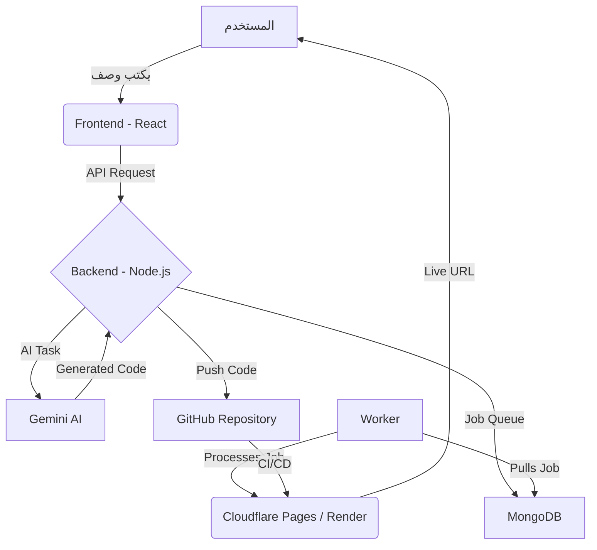

# 🚀 InfinityX AI - توثيق المشروع الكامل

**المؤلف**: Manus AI
**التاريخ**: 31 أكتوبر 2025

## 📜 نظرة عامة

InfinityX AI هو نظام ذكاء اصطناعي متكامل تم تصميمه ليكون **نظاماً ذاتي التطوير** (Self-Evolving System). هذا يعني أن النظام قادر على تصميم وتطوير نفسه، بالإضافة إلى بناء ونشر مشاريع ويب كاملة بناءً على وصف نصي بسيط من المستخدم.

### الأهداف الرئيسية للمشروع:

1.  **التطوير الذاتي**: تمكين النظام من تصميم وتطوير واجهاته الخاصة باستخدام الذكاء الاصطناعي.
2.  **بناء الصفحات والمواقع**: توفير أداة (Page Builder) تسمح للمستخدم بوصف صفحة ويب، موقع، أو متجر إلكتروني، ويقوم النظام بتوليد الكود، رفعه على GitHub، ونشره تلقائياً.
3.  **تكامل المتاجر العالمي**: دعم التكامل مع أي منصة تجارة إلكترونية (Shopify, WooCommerce, Magento, Custom APIs) لتحليل المتاجر وتقديم توصيات ذكية.
4.  **نظام Worker لمعالجة المهام**: بناء نظام خلفية قوي وموثوق لمعالجة المهام الثقيلة في الخلفية (مثل بناء المشاريع، تحليل البيانات، إلخ).

---

## ✨ الميزات الرئيسية

| الميزة | الوصف | الحالة | التقنيات المستخدمة |
| :--- | :--- | :--- | :--- |
| **🤖 Self-Design & Development** | النظام يصمم واجهاته بنفسه، يضيف ميزات جديدة، ويحسن نفسه تلقائياً. | ✅ **مكتمل** | Gemini AI, React, Node.js |
| **🎨 AI Page Builder** | يكتب المستخدم وصفاً، ويقوم النظام ببناء ونشر صفحة/موقع/متجر كامل. | ✅ **مكتمل** | Gemini AI, Octokit, GitHub API |
| **🌐 Universal Store Integration** | يتكامل مع أي متجر إلكتروني لتحليل البيانات وتقديم توصيات ذكية. | ✅ **مكتمل** | Axios, Gemini AI |
| **⚙️ Worker System** | نظام خلفية قوي لمعالجة المهام الثقيلة (Jobs) بشكل موثوق. | ✅ **مكتمل** | MongoDB, Node.js |
| **🔒 نظام مصادقة متكامل** | نظام تسجيل دخول وتسجيل آمن مع دعم الأدوار (Super Admin). | ✅ **مكتمل** | bcrypt, JWT |

---

## 🔧 البنية التقنية (Architecture)

يتكون النظام من جزأين رئيسيين:

1.  **Backend (Node.js & Express)**: هو العقل المدبر للنظام. يحتوي على:
    *   **API Endpoints**: للتحكم في جميع ميزات النظام (Page Builder, Store Integration, Self-Design).
    *   **Gemini AI Integration**: للتواصل مع نماذج Google AI لتوليد الكود والتحليلات.
    *   **GitHub Integration**: باستخدام Octokit لإنشاء وتحديث المستودعات تلقائياً.
    *   **Worker System**: لإدارة ومعالجة المهام في الخلفية.
    *   **MongoDB Database**: لتخزين بيانات المستخدمين، المهام، والمشاريع.

2.  **Frontend (React & Vite)**: هي لوحة التحكم (Dashboard) التي يتفاعل معها المستخدم. تحتوي على:
    *   **واجهة Page Builder**: حيث يكتب المستخدم وصف المشروع.
    *   **واجهة Store Integration**: لربط المتاجر الإلكترونية.
    *   **واجهة Self-Design**: لتفعيل ميزات التطوير الذاتي.
    *   **عرض حي للبيانات**: مثل حالة النظام، المهام الحالية، وآخر الأنشطة.

### رسم توضيحي للبنية:

*سيتم تحويل هذا الرسم إلى صورة عند العرض.*

---

## 🚀 كيفية استخدام AI Page Builder

1.  **اذهب إلى صفحة Page Builder**: من لوحة التحكم، اختر "🚀 Page Builder".
2.  **اختر نوع المشروع**: صفحة واحدة، موقع كامل، أو متجر إلكتروني.
3.  **اكتب الوصف**: كن دقيقاً قدر الإمكان. مثال: "صفحة رئيسية لشركة تقنية تعرض خدماتنا، فريقنا، ومعلومات الاتصال".
4.  **اختر نمط التصميم**: Modern, Minimal, Creative, Professional, or Playful.
5.  **أضف الميزات**: مثل "Contact form, testimonials, image gallery".
6.  **أدخل معلومات GitHub**: في قسم "Settings"، أدخل اسم مستخدم GitHub و Personal Access Token.
7.  **اضغط على "🚀 بناء ونشر"**.

سيقوم النظام بالباقي! خلال دقائق، ستحصل على رابط لمستودع GitHub ورابط مباشر للموقع المنشور.

---

## 🛍️ كيفية استخدام Universal Store Integration

1.  **اذهب إلى صفحة Stores**: من لوحة التحكم، اختر "🛍️ Stores".
2.  **اختر المنصة**: Shopify, WooCommerce, أو حتى Custom API.
3.  **أدخل معلومات المتجر**: رابط المتجر، API Key, Access Token, إلخ.
4.  **اضغط على "🔗 اختبار الاتصال"**: للتأكد من صحة المعلومات.
5.  **اضغط على "📦 جلب المنتجات"**: لجلب عينة من منتجات المتجر.
6.  **اضغط على "🔍 تحليل المتجر"**: سيقوم الذكاء الاصطناعي بتحليل متجرك وتقديم تقرير كامل عن:
    *   نقاط الضعف والقوة.
    *   توصيات لتحسين SEO.
    *   نصائح لزيادة المبيعات (CRO).
    *   استراتيجية طويلة المدى.

---

## 🌟 الخلاصة

InfinityX AI هو أكثر من مجرد نظام، بل هو منصة متكاملة وذكية قادرة على التطور والتكيف. من خلال الجمع بين قوة الذكاء الاصطناعي، التكامل السلس مع GitHub و Cloudflare، والبنية القوية، يقدم النظام حلاً ثورياً في عالم تطوير الويب.

**هذا المشروع يمثل خطوة نحو مستقبل يكون فيه تطوير البرمجيات أسرع، أذكى، وأكثر سهولة للجميع.**
